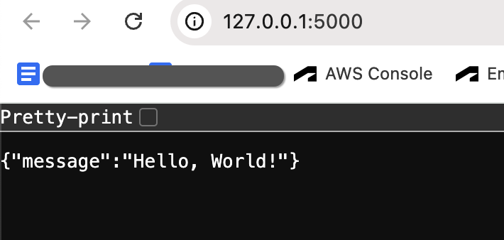

# Customer Management API

Demonstrate a sample implementation of end-to-end REST API development using Flask, Python, SQLAlchemy(ORM), Docker, Kubernetes, Telemetry, and Helm Chart.
This RESTful web service operates on customer data.

## Code
### Git set up
Crete git Repo
```
git clone git@github-manojknit:manojknit/customer_management_api.git
# Modify Project and commit
git add .
git commit -m "first test run"
git push -u origin main
```

Open or create a requirements.txt file in your project directory.
Add the Flask dependency to the file.
```
Flask==3.0.3
```

### Run
```
pip3 install -r requirements.txt
python3 routes.py
```
### Verify
http://127.0.0.1:5000

### Verify
http://127.0.0.1:5000
{:height="200px" width="300px"}