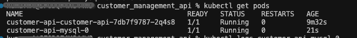

# Customer Management API

Demonstrate a sample implementation of end-to-end REST API development using Flask, Python, SQLAlchemy(ORM), Docker, Kubernetes, Telemetry, and Helm Chart.
This RESTful web service operates on customer data.

## Code Base
### Project Structure
project structure will look like this:
```
customer_api/
│
├── customer_api/
│   ├── __init__.py
│   ├── models.py
│   ├── routes.py
│   ├── database.py
│   └── telemetry.py
├── Dockerfile
├── requirements.txt
└── helm/
    └── customer-api/
        ├── Chart.yaml
        ├── values.yaml
        └── templates/
            ├── deployment.yaml
            └── service.yaml
```


### Git set up
Crete git Repo
```
git clone git@github-manojknit:manojknit/customer_management_api.git
# Modify Project and commit
git add .
git commit -m "first test run"
git push -u origin main
```

Open or create a requirements.txt file in your project directory.
Add the Flask dependency to the file.
```
Flask==3.0.3
```

### Run
```
pip3 install -r requirements.txt
python3 routes.py
```
upgrade
```
pip3 install upgrade-requirements
upgrade-requirements
```
### Verify
http://127.0.0.1:5000


# Prerequisites
- Python 3.9 or higher installed.
- PostgreSQL installed and running.
- Docker installed.
- Helm installed.
- Kubernetes cluster minikube running.

### Test
```
# check recent version 
helm search repo bitnami/postgresql --versions
helm search repo bitnami/mysql --versions

psql --host 127.0.0.1 -U user -d customerdb -p 5433

minikube start
minikube addons enable ingress
eval $(minikube docker-env)

helm repo add bitnami https://charts.bitnami.com/bitnami
helm repo update


docker build -t customer-service:latest .
# Assuming a local registry is running at localhost:5000. if not do following
# $ docker pull registry
# $ docker run -d -p 5001:5000 --restart always --name registry registry:2
docker tag customer-service:latest localhost:5001/customer-service:latest
docker push localhost:5001/customer-service:latest
# interact with the registry, you can access it at http://localhost:5001/v2/_catalog.
# run docker locally to test docker image
# docker run -d --name customer-service-test -p 6000:5000 localhost:5001/customer-service:latest
# curl http://localhost:6000/
# docker exec -it customer-service-test sh
docker stop customer-service-test
docker rm customer-service-test
docker exec -it customer-service-test sh


helm uninstall customer-api
helm dependency update ./helm/customer-api
helm install customer-api ./helm/customer-api

#verify pods
kubectl get pods
curl http://localhost:7000/

# Postgre
kubectl exec -it customer-api-postgresql-0 -- /bin/sh
psql -U user -d customerdb

CREATE TABLE customers (
    id SERIAL PRIMARY KEY,
    full_name VARCHAR(255) NOT NULL,
    email VARCHAR(255) UNIQUE NOT NULL,
    phone_number VARCHAR(50)
);

# mySQL
kubectl exec -it customer-api-mysql-0 -- sh
mysql -u user -p
USE customerdb;
CREATE TABLE `customers` ( id INT AUTO_INCREMENT PRIMARY KEY, full_name VARCHAR(255) NOT NULL, email VARCHAR(255) UNIQUE NOT NULL, phone_number VARCHAR(50) );


# if error- check log
kubectl logs customer-api-mysql-0
```

### Pods
